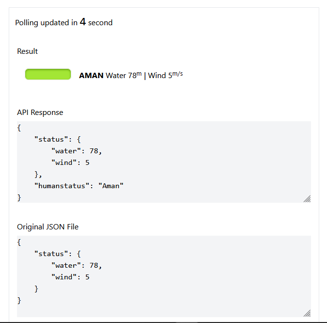
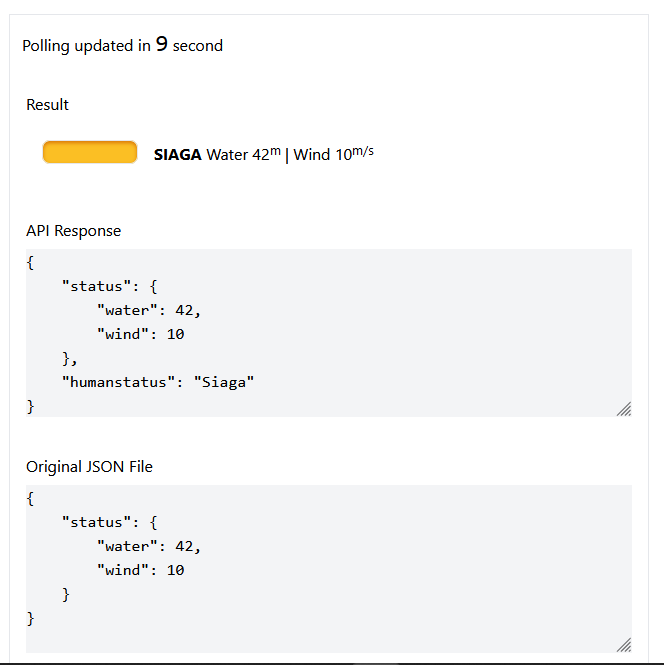
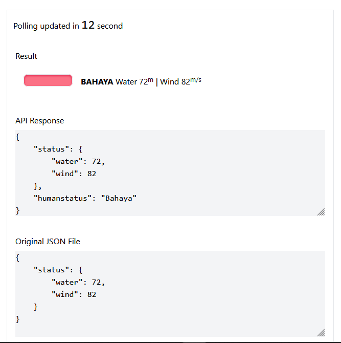

# About

Auto polling 15 second and update JSON with Go

<div style="display:flex">



</div>

## Installation

```bash
git clone -b pool https://github.com/wahyusa/go-learn.git
```

This project just use internal Go package without any dependencies.

## Usage

Running basic HTTP server on port `6969`

```bash
go run main.go
```

### Accessible URL

1. API

http://localhost:6969/weather

2. Frontend UI

http://localhost:6969/

3. JSON File

http://localhost:6969/weather.json
